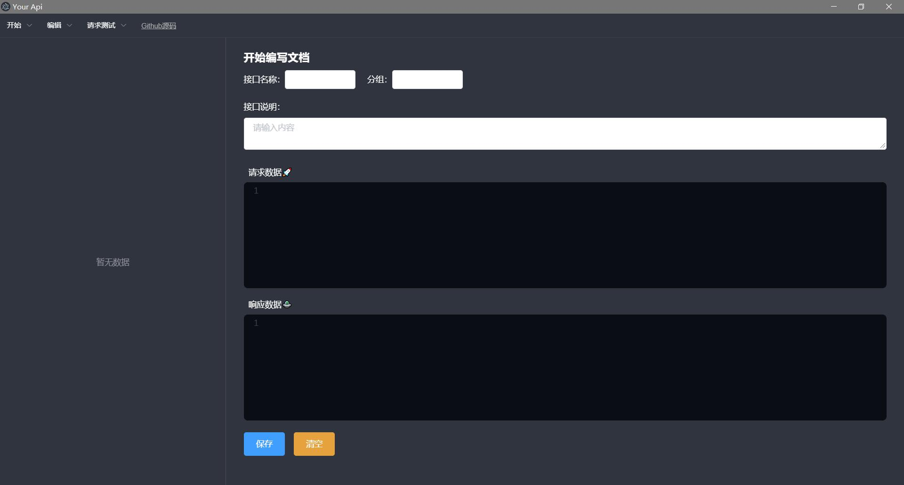
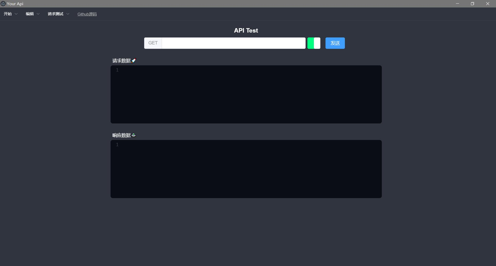

# your-api
一个基于electron的rest api测试发布工具，集成了api文档的编写

# 依赖

> 开发环境
>
> node v10.15.3
>
> vuecli v4.1.1

## 介绍

这是一个rest API测试工具，你可以使用它测试你的restapi并且得到返回值。目前的请求方式支持get和post。使用两种不同的测试工具Fetch和Axios，你可以再配置中修改它们。

提供简单的api文档编写功能，你可以新建文档并按功能添加自己的api描述，最终的文档将保存为json文件。正在考虑将文档转换为markdown格式文件。

## 预览






## 二次开发

你可以下载本项目的源码进行二次开发

```bash
cd your-api
npm install
//start
npm run electron:serve
```


## 试用

 [v0.0.1](https://github.com/Landers1037/your-api/releases/tag/0.0.1)

